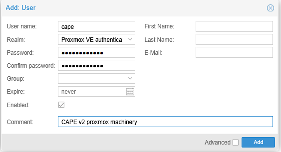
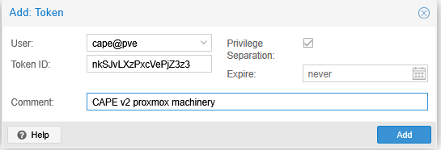
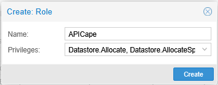
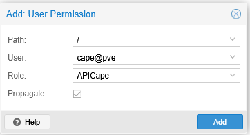

# CAPE v2 - Proxmox Installation 2025

This is ongoing stuff, personnal notes

## Structure

- **Cape host** : Ubuntu Server 24.04 LXC
- **Cape guest1** : Windows 10 VM

## Network

- **vmbr0** : 10.12.0.0/24 - Proxmox default
- No need of an isolated one, we will put some Proxmox firewalls rules on the guests

## Setting up Ubuntu 24 Host

Let's create the Ubuntu LXC (2 CPUs / 4GB RAM / 24GB SSD), on 10.12.0.70.

Create a ```cape``` user use sudo permissions

Download and edit the cape installer script

```bash
wget https://raw.githubusercontent.com/kevoreilly/CAPEv2/master/installer/cape2.sh
chmod +x cape2.sh
# Setup your IP and INTERFACE inside
```

Then run the ```Base``` installer as ```cape``` user

```bash
sudo ./cape2.sh Base | tee cape-base.log
```
Then you can reboot, and install some dependencies

```bash
cd /opt/CAPEv2
poetry run pip install -U proxmoxer
poetry run pip install -r extra/optional_dependencies.txt
```

We will configure CAPE itself later on, let's move the the guest vm.

## Setting up Windows 10 Guest

Download the Microsoft official Windows 10 ISO and the virtio drivers ISO [here](https://fedorapeople.org/groups/virt/virtio-win/direct-downloads/stable-virtio/virtio-win.iso)\
Create a VM as usual, I gave mine 4 CPUs / 8GB RAM / 64GB SSD for now, will see later.  
Give your VM a unique proxmox Name if you have multiple nodes !!  
Since the goal is to have a Guest as realistic as possible, don't put Qemu Agent and other fancy stuff on.

For the Windows install, go for the classical with a standard account, saying no to Microsoft fancy question.
On boot up, set the IP to a static one, I put 10.12.0.71 in my case.  
We will setup Proxmox firewall in later section.

Check [this](https://www.informatiweb.net/tutoriels/informatique/windows/windows-10-11-ajouter-l-editeur-de-gpo-gpedit-msc-sous-windows-famille.html) to enable ```gpedit.msc``` on Windows 10, we will need it

Now in order for the cape agent to work, we need a 32 bits Python.  
I recommend to use ```Python 3.12.4```, available [here](https://www.python.org/downloads/release/python-3124/).  
Reason is some later versions won't have some libs in the default install.

Then, there is quite some nice guides about how to setup a Windows guest (apps to install, noise to remove) you can refer to this link : https://endsec.au/blog/building-an-automated-malware-sandbox-using-cape/  
Also, CAPE team made some usefull script to disable noise & so, check them in ```installer/```

## Setting up the Proxmox REST API

**The plan is** to setup a User, give him an API token, a specific role

In Proxmox Web UI, Datacenter > Permissions > Users > Add :  
  
You can generate a Token ID from a random string of Characters/Numbers.  
Write down username/password for later

Next,  Datacenter > Permissions > API Tokens > Add


Then write down the given Token ID and Secret for later. 

Now, Datacenter > Permissions > Roles > Create
  
You can fine tune those Permissions later on, for now I recommend you to simply check all of them, more info [here](https://pve.proxmox.com/pve-docs/pve-admin-guide.html#pveum_permission_management)  

Let's now give the User the created role
Datacenter > Permissions > Add > User Permission
  


If you got lost in the process, or want to check if you're good with this section, feel free to check [this](https://i12bretro.github.io/tutorials/0572.html)

## Configuration

Let's now dive into ```conf/```, first the mandatory config for our untypical install and then some other additional modules

### Mandatory config

Here you need to put your user credentials from the Proxmox API setup section, in my case username is ```cape@pve``` and the password is the one from the first step of the section.  
Then you have to define your machines, at least one, the minimum config is
```ini
[win10]
label = win10-cape
platform = windows
ip = 10.12.0.71
arch = x64
```
... to continue

### Modules

ssl/tls  
trid, guacamole, Geolite, box4js

## SSL/TLS

todo

### Guacamole

Guacamole is a must, it allows you to visualize and interact with the VM during the analysis (like ANYRUN for example).  
For this to work, you need to install it in the CAPE side, by doing

```bash
cd installer/
sudo ./cape2.sh guacamole | tee cape-guacamole.log
```

Then, we need to do some tricks on the Proxmox side:

todo

Configuration is in ```conf/web.conf```

## Notes

Maybe Ubuntu server on LXC is stupid  
Screenshots of steps when all setup is done
Proxmox firewall section  
Web SSL/TLS setup todo as well  

## Ressources

https://4d5a.re/proxmox-cuckoo-a-powerful-combo-for-your-home-malware-lab/
https://endsec.au/blog/building-an-automated-malware-sandbox-using-cape/
https://github.com/rebaker501/capev2install#getting-some-dependencies-out-of-the-way  
https://i12bretro.github.io/tutorials/0572.html